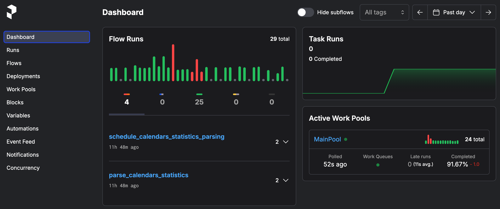
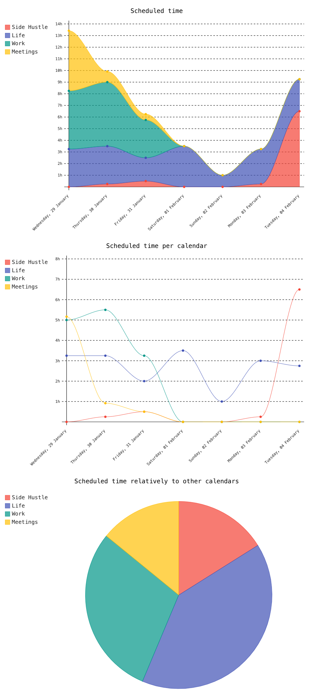
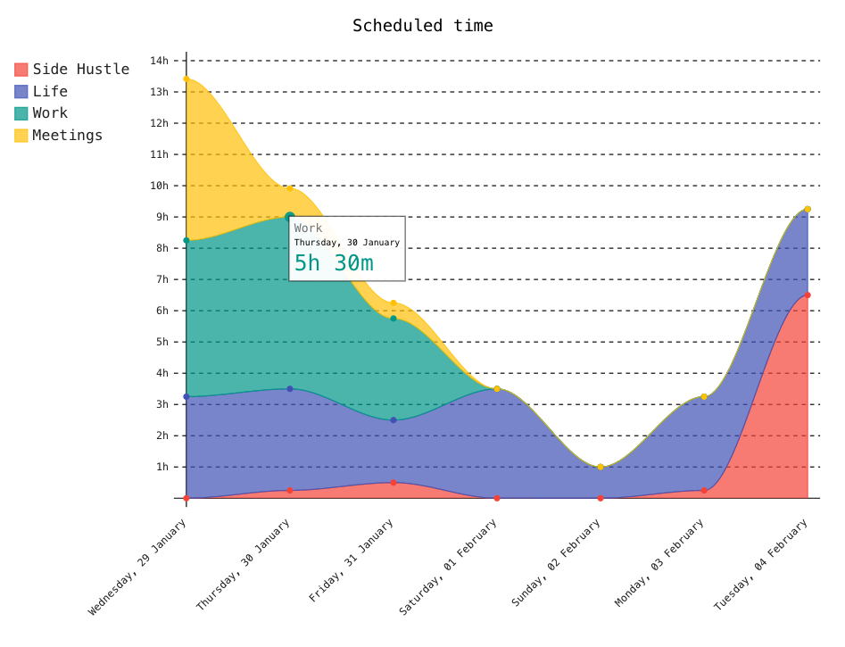

# PT (Productivity Tracker)
Get statistics about your personal productivity from calendar using simple telegram bot. Load link, grant read access for the bot and get regular reporst with nice dashboards.

## [WIP] Telegram
Telegram bot api is used to allow users register, manage calendars and recieve reports.

## Orchestration
[Prefect](https://github.com/PrefectHQ/prefect) is used for scheduling and managing runs of background tasks. 
You can run tasks manualy and view its logs using Prefect UI on `http://0.0.0.0:4200`.

## Statistics
Prefect will run flow automaticly according to the schedule and parse users activity info for the previous day.
It stores only date and total planned time for every calendar.

For now there is only integration with [Google Calendar](https://developers.google.com/calendar/api/v3/reference/).

## Reports
Prefect can also run task to build html report using parsed statistics. 

[Pygal](https://www.pygal.org/en/stable/index.html) is responsible all beautiful charts. It renderds SVG charts that are
embedded into html template. After all task will send this html report to the user.

And all this charts are interactive. You can click and get some details.

